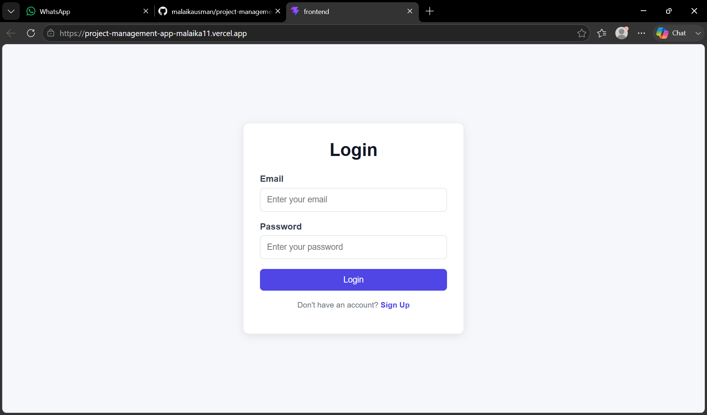
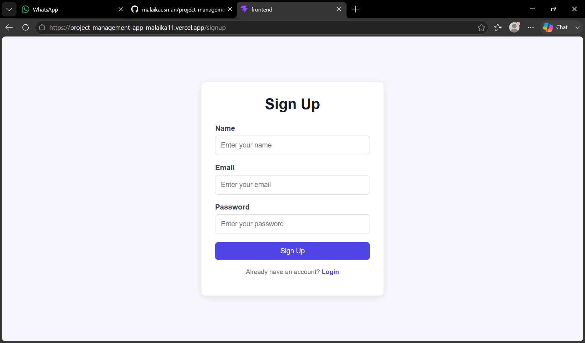
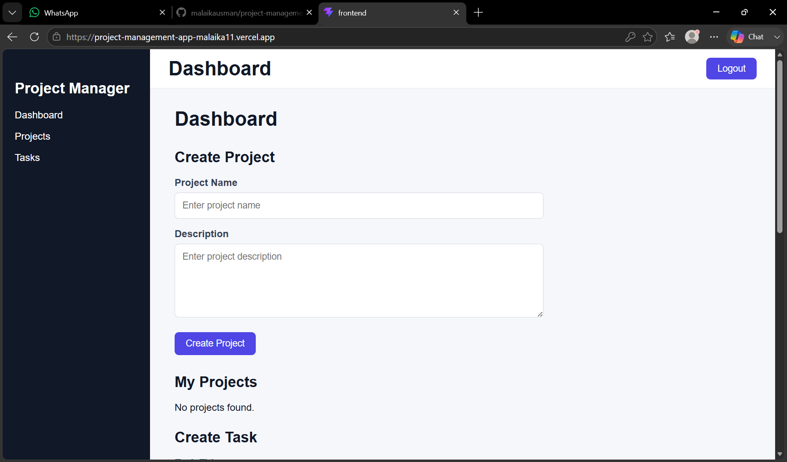
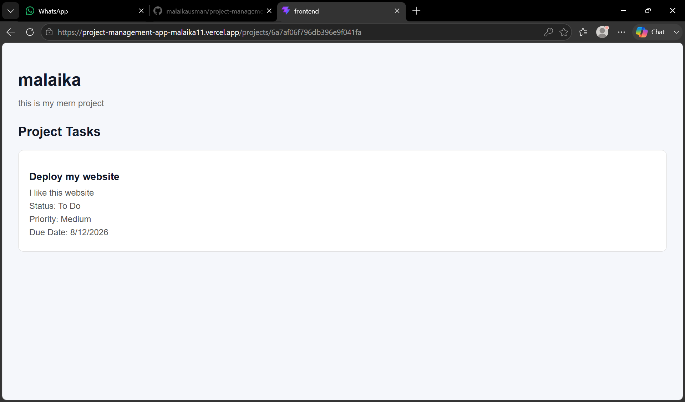

# 📋 Project Management App

A full-stack **MERN Project Management Application** for creating, managing, and organizing projects and tasks with secure user authentication.

## 🌐 Live Demo

**Live Website:**  
https://project-management-app-mauve-sigma.vercel.app/

**Backend API:**  
https://project-management-backend-jg7i.onrender.com

**GitHub Repository:**  
https://github.com/malaikausman/project-management-app

---

## ✨ Features

- 🔐 User Signup & Login
- 🔑 JWT Authentication
- 🔒 Protected Routes
- 📁 Create, View, Update & Delete Projects
- ✅ Create, View, Update & Delete Tasks
- 👤 User-specific Data
- 📱 Responsive Design
- 🌐 REST API
- ☁️ Cloud Database
- 🚀 Full-stack Cloud Deployment

---

## 🛠️ Tech Stack

**Frontend**
- React
- Vite
- React Router
- Axios
- CSS

**Backend**
- Node.js
- Express.js
- REST API
- JWT
- bcrypt

**Database**
- MongoDB
- Mongoose
- MongoDB Atlas

**Tools & Deployment**
- Git & GitHub
- Postman
- VS Code
- Vercel
- Render

---

## 🔐 Authentication

The application includes secure user authentication using:

- User registration
- User login
- Password hashing with bcrypt
- JWT tokens
- Protected backend routes
- Authorization through Bearer tokens

---

## 📁 Project Management

Users can manage their projects and tasks using full CRUD functionality.

**Projects**
- Create projects
- View projects
- Update projects
- Delete projects

**Tasks**
- Create tasks
- View tasks
- Update tasks
- Delete tasks

---

## 🏗️ Application Architecture

```text
React + Vite
     ↓
   Axios
     ↓
Node.js + Express
     ↓
   Mongoose
     ↓
MongoDB Atlas
```

The frontend is hosted on **Vercel**, the backend is hosted on **Render**, and the database is hosted on **MongoDB Atlas**.

---

## 📸 Screenshots

### 🔐 Login



### 📝 Signup



### 📊 Dashboard



### 📁 Project Details



---

## 🚀 Deployment

| Component | Platform |
|---|---|
| Frontend | Vercel |
| Backend | Render |
| Database | MongoDB Atlas |

**Production Flow:**

```text
User
 ↓
Vercel
 ↓
Render
 ↓
MongoDB Atlas
```

---

## 💻 Run Locally

### Clone the repository

```bash
git clone https://github.com/malaikausman/project-management-app.git
cd project-management-app
```

### Start the frontend

```bash
cd frontend
npm install
npm run dev
```

### Start the backend

Open another terminal:

```bash
cd backend
npm install
npm start
```

Create a `.env` file inside the `backend` folder:

```env
MONGO_URI=your_mongodb_connection_string
JWT_SECRET=your_jwt_secret
PORT=5000
```

**Never upload your real `.env` file, MongoDB password, or JWT secret to GitHub.**

---

## 🧪 Testing

The application has been tested for:

- Signup & Login
- JWT Authentication
- Protected Routes
- Project CRUD
- Task CRUD
- MongoDB Data Persistence
- Responsive Design
- Mobile Usage
- Production API Communication

---

## 🎯 Project Purpose

This project was built as a practical full-stack application to develop and demonstrate skills in:

- React
- Node.js & Express
- REST APIs
- MongoDB & Mongoose
- Authentication & Authorization
- Git & GitHub
- Frontend-Backend Integration
- Cloud Deployment

---

## 👩‍💻 Author

**Malaika Usman**  
BS IT Student

---

⭐ **Project Management App — Built with the MERN Stack**
